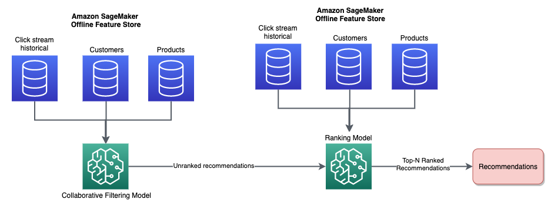
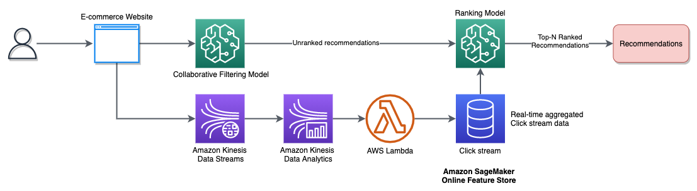

# A Real-Time Recommendation Engine with SageMaker Feature Store

## Use Case

In this repository, we will build a real-time recommendation engine for an e-commerce website using a synthetic online grocer dataset. We will use [Amazon SageMaker Feature Store](https://docs.aws.amazon.com/sagemaker/latest/dg/feature-store.html)(both _online_ and _offline_) to store feature data that will be used for model training, validation and for real-time inference. The recommendation engine will suggest top products that a customer is likely to purchase while browsing through the e-commerce website based on the customer's purchase history, real-time click stream data, and other customer profile information. The solution is a combination of two ML models - a _Collaborative Filtering model_ and a _Ranking model_.

### Collaborative Filtering model

We will use a collaborative filtering model based on matrix factorization using the [Factorization Machines Algorithm](https://docs.aws.amazon.com/sagemaker/latest/dg/fact-machines.html) to retrieve product recommendations for a customer. This will be based on customer profile and past purchase history of a customer in addition to features such as product category, name, and description. The customer's historical purchase data and product data from the e-commerce store's product catalog are stored in two separate offline Feature Store [_feature groups_](https://docs.aws.amazon.com/sagemaker/latest/dg/feature-store-create-feature-group.html) that will be combined to train this model.

### Ranking model

We will also train an [XGBoost](https://docs.aws.amazon.com/sagemaker/latest/dg/xgboost.html) model based on click stream historical aggregates data to predict a customer's propensity to buy a given product. We will use aggregated features on real-time click stream data (stored and retrieved in real-time from the SageMaker Feature Store) along with product category features. We will use [Amazon Kinesis Data Streams](https://docs.aws.amazon.com/streams/latest/dev/introduction.html) to stream real-time click stream data and [Amazon Kinesis Data Analytics](https://docs.aws.amazon.com/kinesisanalytics/latest/dev/how-it-works.html) to aggregate the streaming data using a _[stagger window query](https://docs.aws.amazon.com/kinesisanalytics/latest/dev/stagger-window-concepts.html)_ over a period of the last 2 minutes. This aggregated data will be stored into an online Feature Store _Feature Group_ in real-time to be subsequently used for inference by the ranking model.

### Training Architecture

### Inference Architecture

## Authors

Original authors:

- Bobby Lindsey
- Vikram Elango
- Anjan Biswas
- Arnab Sinha

## Security

See [CONTRIBUTING](CONTRIBUTING.md#security-issue-notifications) for more information.

## License

This library is licensed under the MIT-0 License. See the LICENSE file.
